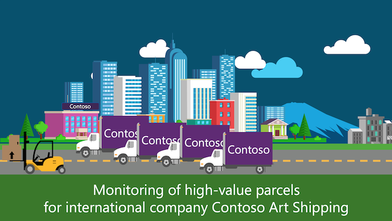

# Azure IoT Workshop: Real-time asset tracking for international company Contoso Art Shipping

## Introduction and Scenario

Contoso Art Shipping Inc. is a company specialized in shipping artwork. They are losing money as their customers are generally dissatisfied with their service – more and more parcel are getting damaged due to adverse weather conditions and improper handling, which causing a tremendous increase in insurance claims, as well as associated personnel costs to follow up on said claims.

Contoso already have an ERP in place and they have built a mobile application that allows to show “basic” tracking information, essentially parcel pick-up date and estimated delivery date.

They realize they need to be more precise on the location of the parcels, conditions during travel, and their overall ability to detect that goods are getting tampered during transport – they ship ~50,000 shipments a month with the issues mentioned above costing them an estimated \$2 per shipment on average, i.e over \$1M every year.

## Contoso Art Shipping's requirements in a nutshell

* **Track** in real-time the physical location and condition of their parcels
* Efficiently **store** this data so that it can be accessed and queried
* Get **alerts** when abnormal conditions are detected…
* …and visualize them on a **map**
* **Integrate** with their existing business applications
* **Scale** from a very small deployment to something much bigger

## Outline

In this workshop, you will be building Contoso Art Shipping's IoT solution.

1. [Connecting an asset tracking device to Azure IoT](step-001-connecting-a-device/)
2. [Setting up a data pipeline](step-002-setting-up-data-pipeline/)
3. [Anomaly detection](step-003-anomaly-detection/)
4. [Map visualization - Where are my parcels?](step-004-map-visualization/)

The last part will showcase how to feed your insights(we'll learn how to trigger events on sudden temperature variations on our asset tracking devices) into Contoso's ERP and mobile application. It will be shown through a demo, as time constraints don't allow for this part to be included in this one-day workshop.

## Supporting slide deck

You can follow along using the [following slide deck](assets/Azure&#32;IoT&#32;Workshop&#32;-&#32;Realtime&#32;asset&#32;tracking.pdf).
