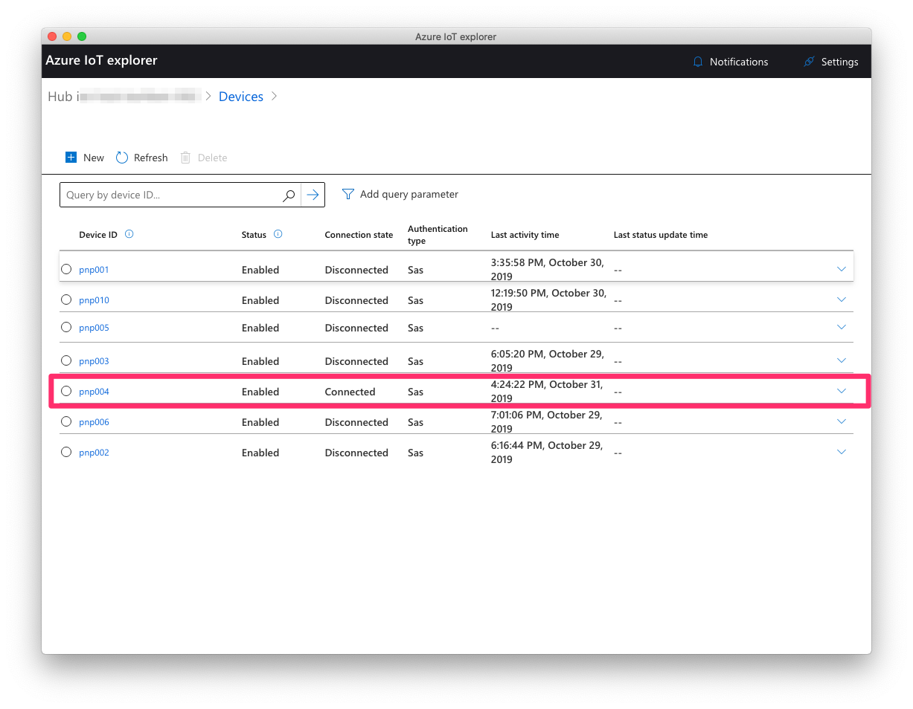

# Connecting a device to Azure IoT <!-- omit in toc -->

In this section, we are going to setup the messaging infrastructure needed to connect Contoso Art Shipping's asset tracking devices. For the context of this lab, the asset tracking device will be the [MXChip developer kit](https://microsoft.github.io/azure-iot-developer-kit/) running a custom firmware that exposes sensor telemetry using [IoT Plug-and-Play](https://docs.microsoft.com/en-us/azure/iot-pnp/overview-iot-plug-and-play).

## Learning goals <!-- omit in toc -->

* Learn how to setup the messaging infrastructure for connecting your IoT devices.
* Get familiar with IoT developer tools such as [Visual Studio Code Azure IoT Workbench](https://marketplace.visualstudio.com/items?itemName=vsciot-vscode.vscode-iot-workbench) and [Azure IoT Explorer](https://github.com/Azure/azure-iot-explorer).
* Understand basic security and device management concepts.

## Steps <!-- omit in toc -->

* [Create a resource group](#create-a-resource-group)
* [Create an Azure IoT Hub and an Azure Device Provisioning Service](#create-an-azure-iot-hub-and-an-azure-device-provisioning-service)
* [Connect the MXChip Plug-and-Play asset tracker](#connect-the-mxchip-plug-and-play-asset-tracker)
* [Explore the capabilities of the asset tracking device](#explore-the-capabilities-of-the-asset-tracking-device)

### Create a resource group

1. Create an Azure resource group to collect and manage all the application resources we will be provisioning and using during the workshop.  
\

1. Click on **+ Add** button  
\

1. Enter **Resource group name**,  Select **subscription** and **region**. Click on **Review + Create**, and after reviewing, click on **Create**.

    > **_NOTE:_**  
    >
    > * **Resource Group Name**: Use name of your choice.  
    > * **Region**: During public preview, IoT Plug and Play is available in the North Europe, Central US, and Japan East regions. Although we are only creating a resource group at this stage, please make sure you create it in one of these regions to avoid potential mistakes later on.

### Create an Azure IoT Hub and an Azure Device Provisioning Service

Follow the [instructions from Azure IoT DPS documentation](https://docs.microsoft.com/azure/iot-dps/quick-setup-auto-provision#create-an-iot-hub) to provision an Azure IoT Hub, a Device Provisioning Service, and linking the two together.

> **_IMPORTANT:_**  
>
>  **Make sure to create your IoT Hub in one of the following regions in order to get PnP support during the public preview: North Europe, Central US or Japan East.**

In order to easily find your resources later, you will want to create the IoT Hub and the Device Provisioning Service in the same Resource Group you've created in the previous step.

Once your services are properly provisioned and your DPS service is linked to your IoT Hub instance, you need to create a DPS Group Enrollment. As opposed to single enrollments where you individually "whitelist" and create a set of credentials for every device, a group enrollment can provide you with more flexibility by having a unique set of credentials for all the devices in the same group.

In the Azure Portal, navigate to the Device Provisioning Service you have just created.

In your provisioning service:

1. Click **Manage enrollments**.
2. Click the **Add enrollment group** button at the top.
3. When the "Add Enrollment Group" panel appears, enter the information for the enrollment list entry. **Group name** is required (as a suggestion, you can name the enrollment group "AssetTrackers"). Select "Symmetric Key" for **Attestation Type**.
4. Click **Save**. On successful creation of your enrollment group, you should see the group name appear under the **Enrollment Groups** tab.
5. Select the newly created Enrollment group in the **Enrollment Groups** tab.
6. Click the Copy icon in **Primary Key** in order to copy the symmetric key that has been generated for this enrollment group to your clipboard. You will need it in the following step.

    > **_NOTE:_**  
    >
    > For production use cases, you will want to make sure your device is storing the group symmetric key in some form of secure storage and can't easily be extracted from the device. If your group symmetric key is compromised, it potentially allows anyone to provision devices in your environment.

### Connect the MXChip Plug-and-Play asset tracker

Follow the instructions available [here](https://github.com/kartben/mxchip_pnp_asset_tracker/blob/master/README.md#prepare-the-device) in order to program your MXChip device with a firmware that is PnP compatible, and reports simulated latitude/longitude in addition to real telemetry coming from its sensors.

In addition to your Wi-Fi credentials, you will need to enter the following information for the **Azure IoT DPS Settings**:

* **Device ID**: A unique name identifying your device. Name should be alphanumeric, and may contain special characters including colon, period, underscore and hyphen.
* **ID Scope**: ID Scope for your DPS service. You can find this information in the Azure Portal, in the Overview section of your DPS service. It should be of the form `0ne0009ABCD`.
* **Group SAS Primary Key**: The symmetric key for your enrollment group.

When you've completed these instructions, your MXChip device should be connected to IoT Hub, and sending telemetry information as well as listening to commands. In the next step we will actually explore the device capabilities, using the [Azure IoT Device Explorer](https://github.com/Azure/azure-iot-explorer).

### Explore the capabilities of the asset tracking device

1. Download and install the latest version of the Azure IoT Explorer tool from the [Github release page](https://github.com/Azure/azure-iot-explorer/releases/tag/v0.10.19).

2. Enter your IoT Hub connection string. You can find this information in the Azure portal: open your IoT Hub resource, then go to **Shared access policies** pane, and click on **iothubowner**. You can then copy the **Connection string—primary key**.
  
    

3. Feel free to check the **Remember my connection string** option, then click **Connect**.

4. Select your device from the list that is now displayed. At this point, it should show up as "Connected".

    

5. Use the entries in "IoT Plug and Play components" to explore the capabilities of the device. For example:

    * Navigate to **urn:azureiot:DeviceManagement:DeviceInformation:1** > **Properties (non-writable)**. Note how the device is reporting about its hardware capabilities in a standard way. As a solution builder, you can expect any Plug-and-Play device to always expose these properties, which helps rationalizing device management efforts.
    * Navigate to **urn:mxchip:built_in_sensors:1** > **Telemetry**. Click on the **Start** button and observe the flow of telemetry information being sent every 5 seconds. Also observe how the tool provides you with useful metadata about sensor data, thanks to PnP.
    * Navigate to **urn:mxchip:screen:1** > **Commands**. Test any of the available commands, and enjoy  bidirectional communication with your device!
    * Navigate to **urn:contosoartshipping:position:1** > **Interface**. Often times, the PnP interfaces a device is implementing will be available through either a public Microsoft repository, or a private/company one. There is also an option for the device to implement the `urn:azureiot:ModelDiscovery:ModelDefinition:1` interface, which effectively allows for the interface to be automatically discovered from the cloud by retrieving it from the device. Note how the UI is indicating **Source: On the connected device**, reflecting the fact that the custom 'position' interface has not been found in PnP repository, and instead retrieved from the device.

## Going further <!-- omit in toc -->

If you are interested in exploring further, you may want to think about how to best solve the following problems:

* You aim at connecting tens of thousands of asset trackers in the near future, and realize that you may need more than one IoT Hub instance. It would be handy if you could leverage the Device Provisioning Service to help with assigning a suitable IoT Hub (based on best latency, or other custom rules) to your devices as they connect for the first time, right? Feel free to [explore the docs](https://docs.microsoft.com/en-us/azure/iot-dps/tutorial-set-up-cloud#set-the-allocation-policy-on-the-device-provisioning-service) and experiment!

* In addition to the Azure IoT Explorer, another great developer toolkit comes in the form of the [Azure IoT Tools](https://marketplace.visualstudio.com/items?itemName=vsciot-vscode.azure-iot-tools) extension for Visual Studio Code. It is very easy to configure and use, and can help you troubleshoot your communication scenarios or simulate device data without leaving your development environment.

## Wrap-up and Next steps <!-- omit in toc -->

In this section, we have setup our messaging infrastructure, and used the Azure IoT Explorer to check that our device is properly connected.

In the [next section](../step-002-setting-up-data-pipeline), we will setup the infrastructure needed for storing, visualizing, and querying our IoT data.
