# Setting up an IoT data pipeline <!-- omit in toc -->

In the previous step, we've setup the messaging infrastructure that will allow Contoso Art Shipping to get real-time telemetry from its parcels into the cloud.

They need a data historian to not only store and retain data, but also for ad hoc querying and analysis, as well as visualizations. For example, they need to store all the parcels information (including temperature, humidity, etc.) so that it can be queried by their logisticians to monitor that the handling procedures they're always looking at improving are having a positive impact on the overall condition of the shipments during their journey. They are also interested in building a couple of applications for their end customers and therefore will need access to the historical data for all the parcels so they need API to access it.

Introducing Azure Time Series Insights Preview (TSI)! TSI is an end-to-end PaaS offering to ingest, process, store, and query highly contextualized, time-series-optimized, IoT-scale data. TSI is tailored towards the unique needs of industrial IoT deployments with capabilities including multi-layered storage, time series modeling, and cost-effective queries over decades of data. At the time of writing, the Time Series Insights Preview pay-as-you-go (PAYG) SKU just launched additional features, many of which we will explore during this step.

## Learning goals <!-- omit in toc -->

* How to implement short-term and long-term retention using Azure Time Series Insights
* How to use TSI built-in data explorer to perform data analytics, including:
  * Exploring the various charting options
  * Authoring a time series model
  * Doing ad-hoc investigation
* How to configure and aggregate several event sources

## Steps <!-- omit in toc -->

* [Step 1: Create an Azure Time Series Insights Preview environment](#step-1-create-an-azure-time-series-insights-preview-environment)
* [Step 2: Explore data in your TSI Environment](#step-2-explore-data-in-your-tsi-environment)
* [Step 3: Contextualize and Analyze data](#step-3-contextualize-and-analyze-data)

### Step 1: Create an Azure Time Series Insights Preview environment

1. Sign-in to the Azure portal by using your subscription account.

2. Select Create a resource > Internet of Things > Time Series Insights.  

3. In the Create Time Series Insights environment pane, on the Basics tab, set the following parameters:  

    **Parameter**           | **Action**
    ------------------------|----------------------------------------------------------------------------------
    Environment name        | Enter a unique name for the Azure Time Series Insights Preview environment.
    Subscription            | Enter the subscription you are using for the workshop.
    Resource group          | Select the resource group you are using for the workshop
    Location                | To avoid additional latency, it's best to create your Azure Time Series Insights Preview environment in the same region as the data sources you will be feeding into TSI, so select same location as your IoT Hub.
    Tier                    | Select PAYG (pay-as-you-go). This is the SKU for the Azure Time Series Insights Preview product.
    Property ID             | Enter a value that uniquely identifies your time series instances. The value you enter in the Property ID box is immutable and you can't change it later. For this workshop, the property used to identify the different time series is the identifier of the devices connecting to IoT Hub: **iothub-connection-device-id**. To learn more about Time Series ID, see [Best practices for choosing a Time Series ID](https://docs.microsoft.com/en-us/azure/time-series-insights/time-series-insights-update-how-to-id).
    Storage account name    | Enter a globally unique name for a new storage account.
    Enable Warm Store?      | Select Yes to enable warm store.
    Data Retention (days)   | Choose the default option of 7 days

    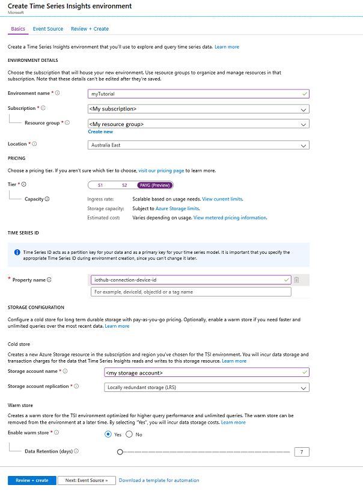

4. Click on “Next: Event Source” to establish a connection between your IoT Hub and TSI:

    **Parameter**           | **Action**
    ------------------------|----------------------------------------------------------------------------------
    Create an event source? | Select Yes.
    Name                    | Enter a unique value for the event source name.
    Source type             | Select IoT Hub.
    Select a hub            | Choose Select existing.
    Subscription            | Select the subscription that you're using for the lab.
    IoT Hub name            | Select the IoT Hub that was created in a previous step.
    IoT Hub access policy   | Select iothubowner.
    IoT Hub consumer group  | Select New, enter a unique name (e.g. 'tsiconsumer'), and then select Add. The consumer group must be a unique value in Azure Time Series Insights Preview.
    Timestamp property      | This value is used to identify the Timestamp property in your incoming telemetry data. Leave this box empty. When left empty, Time Series Insights will default to the message enqueued timestamp in the incoming data source. This is sufficient for the lab.  

5. Click on “Review + create”

    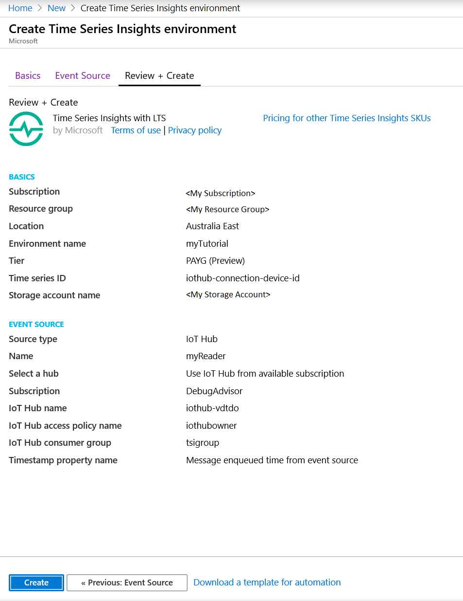

6. Review the values entered and click “Create”

7. Once your deployment is complete, navigate to your new Time Series Insights resource in the Azure portal. You should have access to your environment by default. To verify, select "Data Access Policies" under "Settings." If you do not see your credentials listed, grant yourself access by clicking "Add" and searching for your identity.

    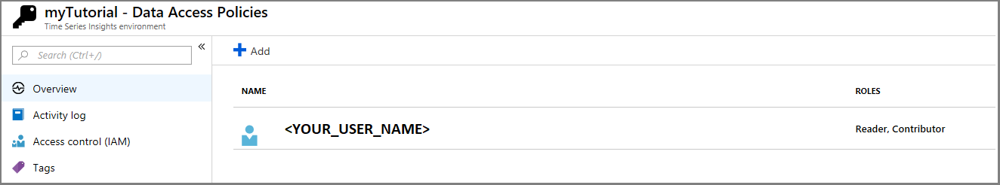

### Step 2: Explore data in your TSI Environment

In this section, you will explore data in your new environment via the Azure Time Series Insights Preview explorer.

1. On the "Overview" pane you'll see the link to your TSI explorer:  

    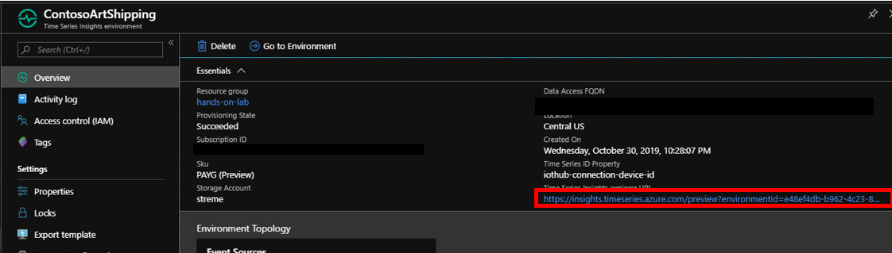

1. Wait for the environment to load in the browser. Once it loads, you'll be on the default landing page. Some of the key features include:

    * Selecting a time range: You can select a different time range by dragging the handles of the availability picker, or using the date-time selector in the top right corner. You can expand the bar to see the volume of data over time, or keep it collapsed for a slimmer look. Any time selection that is within the orange bar boundary will query your Time Series Insights environment's warm store. Warm storage is configurable for up to 31 days retention, and is designed for frequent querying of recent data. There is no charge for these queries.

    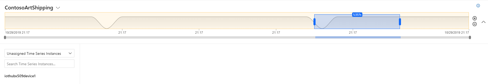

    * Hierarchy: On the left, you'll see the Time Series Model (TSM) hierarchy. Time series that are not yet configured to a hierarchy will fall under the default of "Unassigned Time Series Instances."

    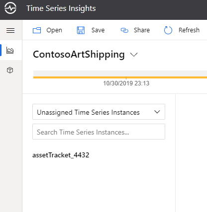

    * Plotting: In the middle of the page is the charting pane where you can visualize events and perform analysis. Below the charting pane is the well which offers additional settings such as time shift and step interpolations.

1. Click on your asset tracker, you'll see the properties available for plotting, click on “Show humidity." If your selected time range is narrow, expand to view more data. Click on additional properties to add them to the chart, including temperature, pressure, accelerometer, and latitude and longitude data:

    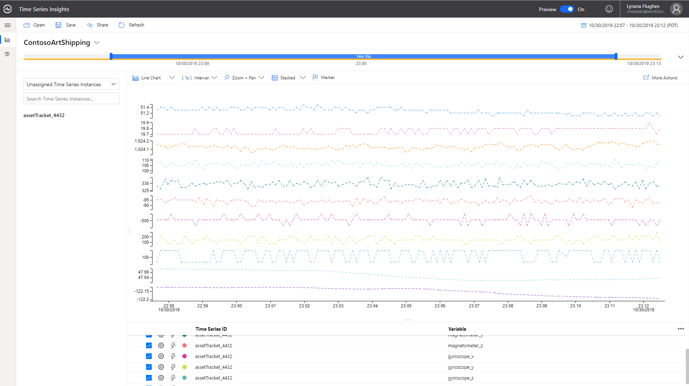

    You can increase the time interval:

    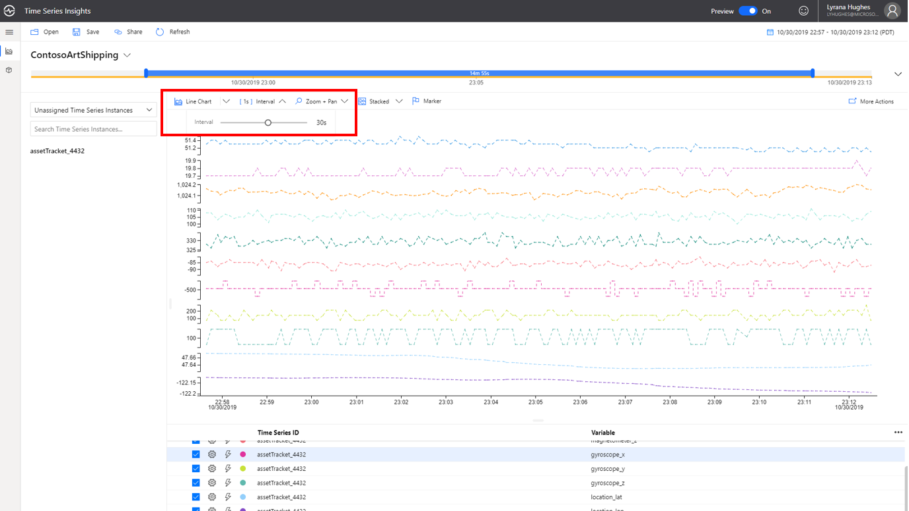

    Your plotted time series are shown below in the well, along with additional settings.

    Click on the gear icon for one of your selected variables to expand the settings, and toggle the options to see the various views available. You'll notice there is also a time shift setting. Time shift allows you to compare a tag to itself over a previous interval in time, and other tags plotted will be de-selected, but remain in the well.

    This is especially useful for data that is highly periodic or seasonal. You will need at least an hours' worth of data to view the time shift, thus it might not be available for you during the lab ; however, the image below shows an example of what this might look like, using the overlap chart view. The ability to select custom time shift intervals in addition to the pre-selected options is on the product roadmap.

    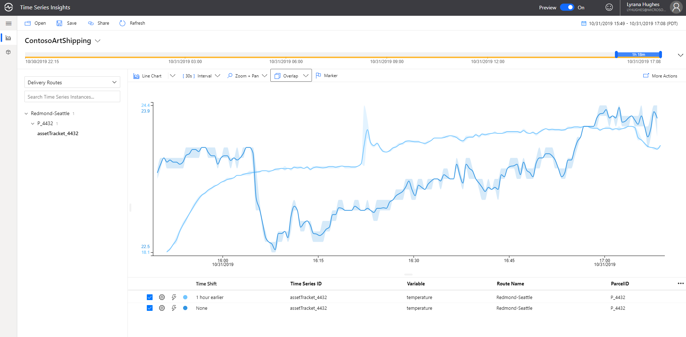

    Uncheck every variable except for temperature, and then change the charting options to heat map:

    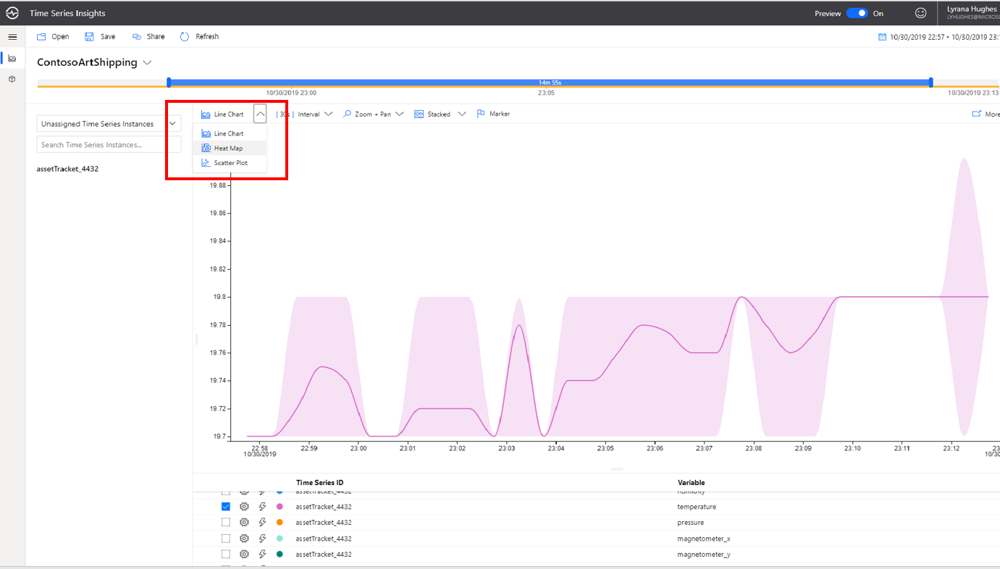

    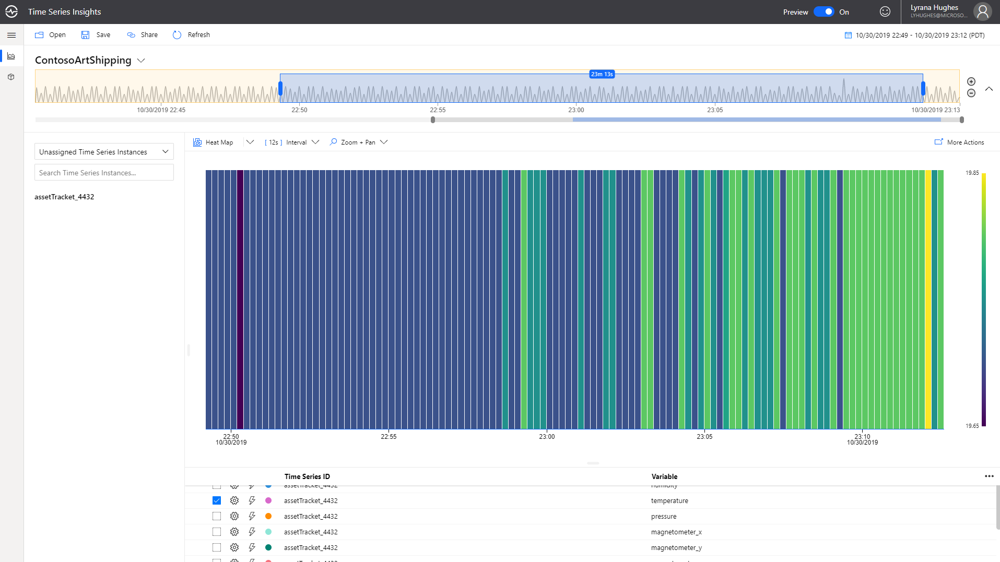

### Step 3: Contextualize and Analyze data

In the previous section, you charted a raw data stream without contextualization. In this section, you will add time series model entities to contextualize your IoT data.
Time Series Model (preview) has 3 components: Types, Hierarchies and Instances.

* **Types** allow users to define calculations, aggregates, and categories over raw telemetry data, as well as define a tag for the sensor (example: Temperature sensor, Pressure sensor). This is achieved by authoring type variables.
* **Hierarchies** allow users to specify the structure of their assets. For example, an organization has buildings and buildings have rooms which contain IoT devices. The hierarchy structure in this case will be (Delivery Routes -> ParcelID).
* **Instances** enrich incoming IoT data with device metadata. An instance links to 1 type definition and multiple hierarchy definitions.

1. In the upper left part of the explorer select the Model tab:

    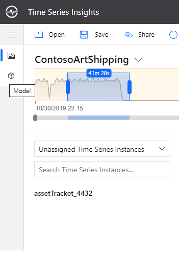

2. Next, we will update the DefaultType and create a categorical variable for a new event (temperature_anomaly) that we'll soon look at sending to TSI using a stream analytics job. We're going to author the variable in anticipation of its value being populated in the future. After anomaly detection has been created, we will come back to TSI to visualize the parcel's condition based on the value of the temperature_anomaly categorical variable.

   Categorical variables allow you to map a discrete value received in an event payload to a specific category label. This enables you to give greater meaning or context to your streaming data, and to ask questions such as "over the past interval, what was the count for a specific category?".

   Contoso Art Shipping ships high-value, original, or highly sentimental artwork, and their trucks have climate-controlled environments. Given the delicate nature of art, significant variations in temperature could cause mild to severe damage, and thus operators want to be alerted to any changes to the shipping environment. We will create a categorical variable that will help label anomalies.  

    * Click on "Types," and on the far right, under "Actions", select the pencil icon.
    * Update the Name from DefaultType to Asset Tracker
    * Update Description from Default type to "Asset tracker equipped with various sensors"
    * Click on "Variables" and select "Add Variable"

        Enter the following:

        * Name: Parcel Condition
        * Kind: Categorical
        * Value: Select Custom and paste the following: `tolong($event.temperature_anomaly.Double)`
        * Categories:
        * Label / Values:
        * Undamaged /  0
        * Damaged / 1
        * Default Category: Unknown

        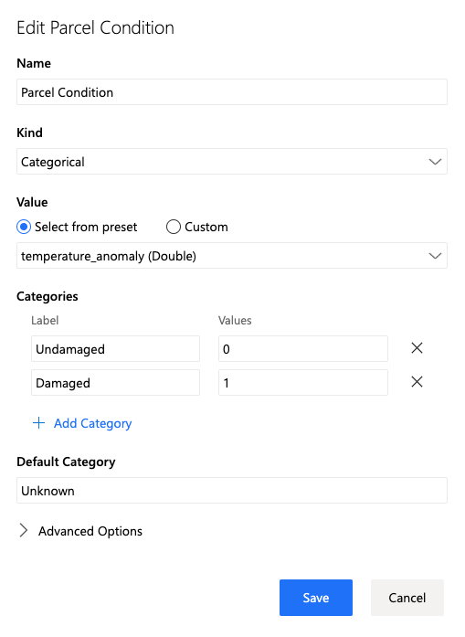

    Click "Apply" and "Save".

    Now that we've explicitly defined a variable on the Asset Tracker type, the auto-discovered properties that we were able to chart in the previous step need to be added as well. You can expedite this process by uploading a JSON file containing the full description of all the Asset Tracker variables.

    Open and save a local copy of the [AssetTrackerType.json file](./AssetTrackerType.json)

    Click on "Upload JSON", "Choose File" and select the saved JSON, then click "Upload." The type variable count should change to 17.

3. The next step is to add a hierarchy. In the Hierarchies section, select "+ Add".

4. A modal will open. Add the following values:

    * Name: Delivery Routes.
    * Levels:
      * Name the first level "Route Name".
      * Click "+ Add Level" and add another sub-level named "ParcelID".

    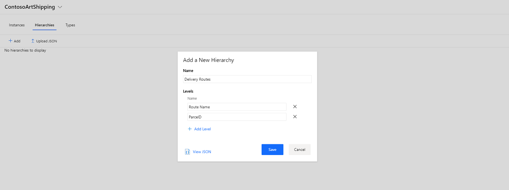

    Click "Save".

5. Next, click on “Instances” and open the edit modal. Verify that the Type in the drop-down is Asset Tracker. Select "Instance Fields" and check Delivery Routes to associate this instance with your hierarchy.

    Enter the following:
    Route Name (from hierarchy) : Redmond-Seattle
    ParcelD (from hierarchy) : Enter a unique identifier for the artwork shipment that your asset tracker is currently tracking

    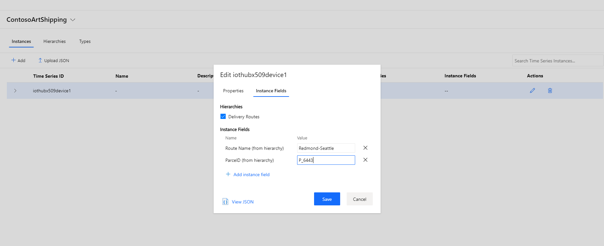

    Save to close the dialog.

6. Navigate back to the Analyze tab to find your tracking device in the Delivery Routes hierarchy under the Redmond-Seattle route, associated to the correct parcel.

## Going further <!-- omit in toc -->

In the context of this lab, you've done a lot of modeling manually. In real-life scenarios, it is likely that you will consider using the TSI APIs to automatically synchronize the definition of hierarchies or instances with other information sources, e.g. your ERPs or CRM.

Also, Time Series Insights has released a Power BI connector in preview. You can capture the query for the current chart by selecting "More Actions" > "Connect to Power BI" on the top right of the chart. You have the option to select aggregated data, or raw events.  

Leaders in your organization might want to have an easy-to-consume snapshot of your organization's overall health, and the Power BI connector enables you to create dashboards that display data from a variety of sources -- operational data can be displayed along with information from finance and accounting.

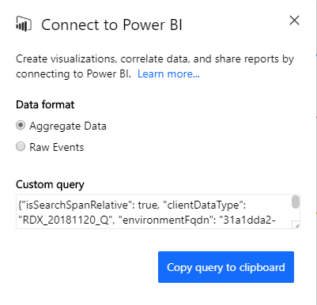

## Wrap-up and Next steps <!-- omit in toc -->

During this step, you've explored Time Series Insights preview explorer's ability to help in ad-hoc investigations.

In the [next section](../step-step-003-anomaly-detection), we will enable anomaly detection using the Azure Stream Analytics and Event Hub services, and we will eventually visualize the anomalies in the TSI Explorer, along with the sensor telemetry.
