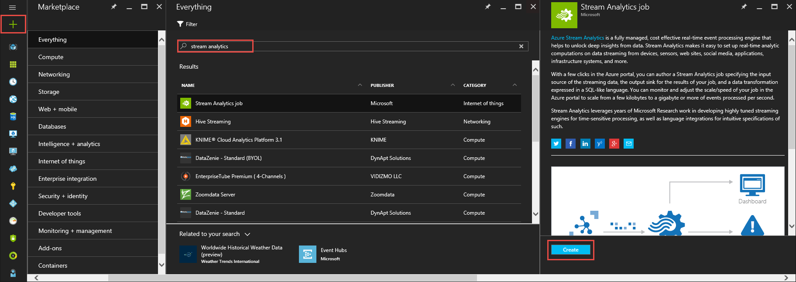
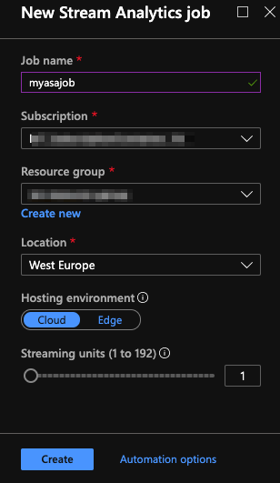
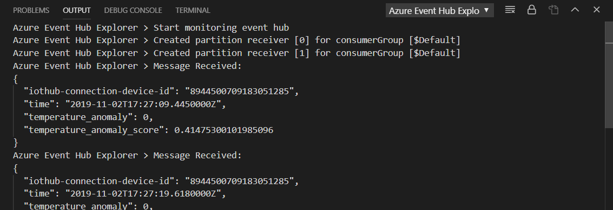
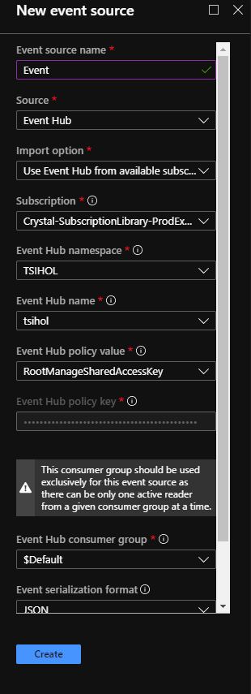
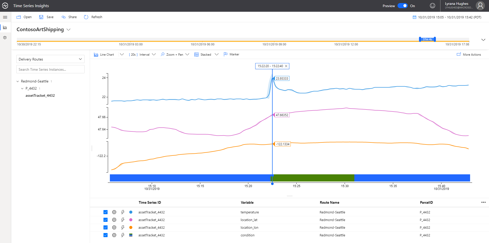

# Anomaly detection <!-- omit in toc -->

Very sudden changes in temperature or humidity can be very problematic for artwork such as paintings.

In this section, we are going to implement a solution for enabling Contoso Art Shipping to detect in real-time when the condition of the parcels may be compromised, i.e **detect when there are sudden temperature spikes or dips**.

We will base our solution on Azure Stream Analytics (ASA). Azure Stream Analytics is a real-time analytics and complex event-processing engine that is designed to analyze and process high volumes of fast streaming data from multiple sources simultaneously.

An Azure Stream Analytics job consists of an input, query, and an output. Stream Analytics ingests data from Azure Event Hubs, Azure IoT Hub, or Azure Blob Storage. The query, which is based on SQL query language, can be used to easily filter, sort, aggregate, and join streaming data over a period of time.

In the section below, we are going to setup an Azure Stream Analytics job that is ta

## Learning goals <!-- omit in toc -->

* How to extract insights from real-time IoT Data using Azure Stream Analytics.
* How to turn alerts into actions.
* How to store alerts into Time Series Insights, alongside telemetry.

## Steps <!-- omit in toc -->

* [Create a Stream Analytics job](#create-a-stream-analytics-job)
* [Create an Event Hub](#create-an-event-hub)
* [Setup input and output for your stream job](#setup-input-and-output-for-your-stream-job)
* [Create a query to detect abnormal temperatures](#create-a-query-to-detect-abnormal-temperatures)
* [Start the Stream Analytics job](#start-the-stream-analytics-job)
* [Checking that the job is running](#checking-that-the-job-is-running)
* [Visualizing anomalies in Time Series Insights](#visualizing-anomalies-in-time-series-insights)

### Create a Stream Analytics job

1. In the [Azure portal](https://portal.azure.com), click the plus sign and then type **Stream Analytics** in the text window to the right. Then select **Stream Analytics job** in the results list, and click **Create**.  
\


1. Fill out the required information to create your job:
   * **Job name**: A unique name for your job.
   * **Subscription**: The Azure subscription you are using for the workshop.
   * **Resource group**: The resource group you are using for the workshop.
   * **Location**: Same location you've picked for your IoT Hub. You could chose a different location but this may have performance and cost issue.
   * **Hosting environment**: Cloud.
   * **Streaming units**: 1.  
\


1. You should see a 'Deployment started...' notification displayed in the top right of your browser window. It should only take a few seconds for it to indicate your job as successfully been created.

### Create an Event Hub

Typically, the output of an Azure Stream Analytics job is something you want to feed into other systems, be they data stores, business processes, etc. Contoso Art Shipping wants to detect sudden spikes or dips in temperature and treat these anomalies "events" at the same level as the telemetry coming in in real-time from the sensors. Therefore, you will use Event Hub as the output for your ASA job, and publish events having virtually the same form as telemetry events coming from the sensors into IoT Hub and that one can subscribe to using the built-in Event Hub compatible endpoint.

Follow the official [instructions](https://docs.microsoft.com/en-us/azure/event-hubs/event-hubs-create) to create a new Event Hub namespace and an Event Hub in your resource group.

### Setup input and output for your stream job

The job we are going to write will process the real-time telemetry coming in from IoT Hub, and output results into Event Hub.

Let's first configure our IoT Hub input:

1. Navigate to your Stream Analytics job.  

2. Select **Inputs** > **Add Stream input** > **IoT Hub**.  

3. Fill out the **IoT Hub** page with the following values.  

   |**Setting**  |**Suggested value**  |**Description**  |
   |---------|---------|---------|
   |Input alias  |  input   |  Enter a name to identify the job’s input.   |
   |Subscription   |  \<Your subscription\> |  The Azure subscription you are using for this workshop. |
   |IoT Hub  |  \<Your IoT Hub\> |  Enter the name of the IoT Hub you created in the previous section. |
   |Consumer Group  |  asaConsumerGroup | This needs to be a different consumer group than the one used by Time Series Insights! |

4. Leave other options to default values and select **Save** to save the settings.  

Now, the Event Hub output:

1. Navigate to the Stream Analytics job that you created earlier.  

2. Select **Outputs** > **Add** > **Event Hub**.  

3. Fill out the **Blob storage** page with the following values:

   |**Setting**  |**Suggested value**  |**Description**  |
   |---------|---------|---------|
   |Output alias |   output   |   Enter a name to identify the job’s output. |
   |Subscription   |  \<Your subscription\> |  The Azure subscription you are using for this workshop. |
   |Event Hub namespace |  \<Your EH namespace\> | The event hub namespace you've created earlier.       |

4. Leave other options to default values and select **Save** to save the settings.  

### Create a query to detect abnormal temperatures

Azure Stream Analytics offers built-in machine learning based [anomaly detection capabilities](https://docs.microsoft.com/en-us/azure/stream-analytics/stream-analytics-machine-learning-anomaly-detection). As Contoso Art Shipping is interested in detecting sudden changes in temperature, we will be using the built-in [`AnomalyDetection_SpikeAndDip`](https://docs.microsoft.com/en-us/azure/stream-analytics/stream-analytics-machine-learning-anomaly-detection#spike-and-dip) function to analyze potential spikes (or dips) in 5-minute sliding windows.

Queries in Azure Stream Analytics are expressed in a SQL-like query language. We will use it to write a query that "SELECT"s the relevant fields from the the IoT Hub messages, make calls to the anomaly detection function to detect potential anomalies (alongside a confidence score), and then output the results to Event Hub.

1. Navigate to the Stream Analytics job that you created earlier.  

2. Select **Query** and update the query as follows:  

```sql
WITH AnomalyDetectionStep AS
(
    SELECT
        IoTHub.ConnectionDeviceId AS id,
        EventEnqueuedUtcTime AS time,
        CAST(temperature AS float) AS temp,
        AnomalyDetection_SpikeAndDip(CAST(temperature AS float), 94, 240, 'spikesanddips')
            OVER(PARTITION BY id LIMIT DURATION(second, 1200)) AS SpikeAndDipScores
    FROM input
    WHERE temperature IS NOT NULL
)
SELECT
    id AS "iothub-connection-device-id",
    time,
    CAST(GetRecordPropertyValue(SpikeAndDipScores, 'IsAnomaly') AS bigint) as temperature_anomaly,
    CAST(GetRecordPropertyValue(SpikeAndDipScores, 'Score') AS float) AS temperature_anomaly_score
INTO output
FROM AnomalyDetectionStep
```

Once this job will start running, it will emit a new event to Event Hub for each IoT Hub message containing a temperature. This event will contain 4 fields:

* **id**: The ID the original device has been using to communicate. That way, we can easily send the anomalies into the same time series that is already collecting the telemetry information.
* **time**: The original timestamp for the temperature for which we are reporting whether it is abnormal or not
* **temperature_anomaly**: An integer, 0 or 1, indicating whether there is an anomaly (1), or not (0).
* **temperature_anomaly_score**: A score (float between 0 and 1). The lower the score, the more confident the anomaly detection is that this is a real anomaly compared to the other data points in the sliding window.

### Start the Stream Analytics job

1. Return to the job overview page and select **Start**.

2. Under **Start job**, select **Now**, for the **Job output start time** field. Then, select **Start** to start your job.

### Checking that the job is running

Visual Studio Code has some great extensions to help you when developing against Azure Services.

If you don't already have it, install the [Azure Event Hub Explorer VS Code extension](https://marketplace.visualstudio.com/items?itemName=Summer.azure-event-hub-explorer).

1. Hit CTRL+SHIFT+P and run **EventHub: Select Event Hub** command to select your subscription, resource group, Event Hub namespace, and finally your Event Hub.

2. Hit CTRL+SHIFT+P again, and this time run **Event Hub: Start Monitoring Event Hub Message**. You should see the messages emitted by your ASA job in the VS Code Output.



> **_NOTE:_**  
>
> Don't forget to run **Event Hub: Stop Monitoring Event Hub Message** command when you're finished. In the next step we are going to use Event Hub as a new event source in TSI, and since we haven't setup a dedicated consumer group in our Event Hub, we need to release access to the `$Default` one.

### Visualizing anomalies in Time Series Insights

1. In the Azure portal, navigate to your TSI instance and click on "Event Sources". Select "Add". Complete all the necessary fields, selecting the Event Hub you configured as the output for the ASA job. You can select the $Default consumer group and leave the Timestamp property blank.

    

2. In general, we see three categories of responses to compute processing for anomaly detection or other purposes: visualization, alerting, and automation.  

    Your solution might be connected to one or many external systems, and depending on your business needs you might utilize a mixture of these responses. After receiving an alert you, as a manager at Contoso Art Shipping may open the TSI explorer to gather more information.  

    Either remove or de-select all data streams except for temperature, lat, lon, and condition. The categorical variable for condition will appear as a colored bar. A multi-colored bar indicates that there is more than one label value present in the selected time range. In the charting options, click on the Marker feature and drop a marker over the start of the anomaly. This allows you to see the exact location when the temperature began to fluctuate:

    

    This illustrates the ability of the Time Series Insights preview explorer to help in ad-hoc investigations, or post-mortems.  

## Going further <!-- omit in toc -->

## Wrap-up and Next steps <!-- omit in toc -->

In the [next section](../step-004-map-visualization), you'll put together a simple web application, using the Azure Maps and TSI JavaScript SDKs, for respectively map and data visualization.
