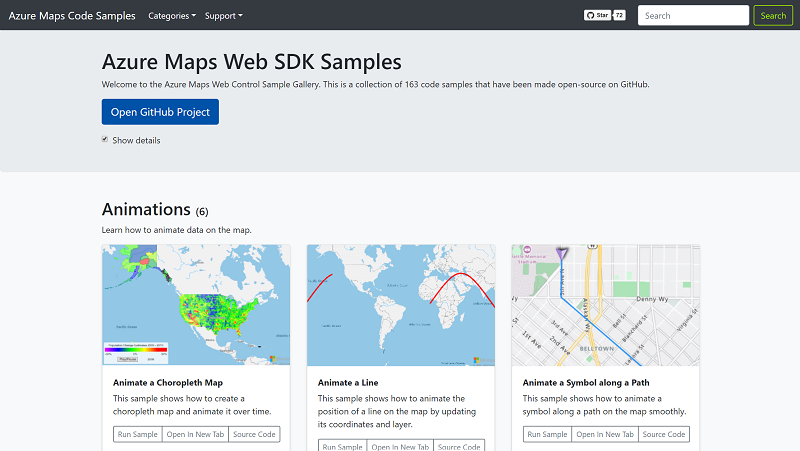

# Map visualization - Where are my parcels? <!-- omit in toc -->

Contoso Art Shipping is interested in being able to visualize in real-time the location of their assets. In the previous step, we've already taken care of storing the geographical position of the asset trackers and telemetry into Time Series Insights. We are now going to look at using the TSI JavaScript SDK to retrieve this data in a web page, and interactively display it on a map by using the Azure Maps Web SDK. 

## Learning goals <!-- omit in toc -->

* How to use the Time Series Insights JavaScript SDK to query and visualize data in a custom web application.
* How to use the Azure Maps Web SDK to create custom and interactive map visualization.

## Steps <!-- omit in toc -->

* [Create an Azure Maps account](#create-an-azure-maps-account)
* [Setup your local development environment](#setup-your-local-development-environment)
* [Complete the JavaScript code](#complete-the-javascript-code)
  * [Replace global variables](#replace-global-variables)
  * [Initialize the Maps component](#initialize-the-maps-component)
  * [Create map layers, data sources, and mouse events](#create-map-layers-data-sources-and-mouse-events)
  * [Map highlighting functions](#map-highlighting-functions)
  * [Query TSI](#query-tsi)
  * [Create a chart](#create-a-chart)
* [Test the application](#test-the-application)

### Create an Azure Maps account

[Create an Azure Maps account](https://docs.microsoft.com/en-us/azure/azure-maps/how-to-manage-account-keys), and [get a subscription key](https://docs.microsoft.com/en-us/azure/azure-maps/tutorial-search-location#getkey) for your account.

You should be fine with the S0 pricing tier but feel free to go for an S1 subscription if you are interested in exploring some of the advanced features only accessible in this tier. Check out the [pricing page](https://azure.microsoft.com/en-us/pricing/details/azure-maps/) for a comparison of S0 and S1 features and pricing.

### Setup your local development environment

1. If you haven't already, clone the current Git repository (`git clone https://github.com/kartben/azure-iot-realtime-asset-tracking-workshop`), and navigate to the `step-004-map-visualization/webapp/` folder.

2. Open the Windows host file located `C:\Windows\System32\drivers\etc\hosts` (or `/etc/hosts` if you are on Linux or MacOS) and add a new line with the following information:
    > `127.0.0.1 insights-local.timeseries.azure.com`

3. Open a terminal.
    > **IMPORTANT** : If you are running Windows, you should open your terminal as administrator.

4. Enter `npm install`.

5. Enter `npm start` (or `sudo npm start` if you are on Linux or MacOS).

At this point, you should have your web browser open at the URL: [https://insights-local.timeseries.azure.com/mapsexample.html](https://insights-local.timeseries.azure.com/mapsexample.html). The application isn't functional just yet, as there is some code for you to complete!

> **_NOTE:_**  
>
> This setup is necessary as we're authenticating against TSI using Azure Active Directory, using a globally registered AAD app that is expecting the web application to specifically run on https://insights-local.timeseries.azure.com. In a real-world scenario, you would probably want to [register your own application](https://docs.microsoft.com/en-us/azure/time-series-insights/time-series-insights-authentication-and-authorization).

### Complete the JavaScript code

In this step, we are going to go through the key elements of the JavaScript client code needed to display an interactive time series chart linked to a map.

There are several `TODO`s throughout the [`script.js`](./webapps/script.js) file.

#### Replace global variables

Towards the beginning of the script, update the values of the following constants to reflect your environment.

```javascript
const TSI_FQDN = '<000000-000000-0000-00000.env.timeseries.azure.com>'; // You can find this in the overview of your Time Series Insights resource in the Azure portal
const AZURE_MAPS_SUBSCRIPTION_KEY = '<Your_Azure_Maps_Key>';            // Your Azure Maps subscription key. Get your key in the "Authentication" section of your Azure Maps service in the Azure Portal
const TIME_SERIES_ID = '<Your_Time_Series_ID>';                         // The ID of the device (and hence associated time series) you want to display in this page
```

#### Initialize the Maps component

First we are going to create a Map instance, and bind it to the `myMap` div of our HTML page.

When loading the map we will set the style to `grayscale_dark` as that will align well with the dark theme of the sample.

Replace the following section:

```javascript
    // TODO: Add code to initialize Map component
    // map = ...
```

with:

```javascript
    //Initialize a map instance.
    map = new atlas.Map('myMap', {
        style: 'grayscale_dark', // see https://docs.microsoft.com/en-us/azure/azure-maps/supported-map-styles

        //Add your Azure Maps subscription key to the map SDK. Get an Azure Maps key at https://azure.com/maps
        authOptions: {
            authType: 'subscriptionKey',
            subscriptionKey: AZURE_MAPS_SUBSCRIPTION_KEY
        }
    });
```

Following the creation of the map, we will subscribe to its `ready` event and implement the rest of our initialization code there.

#### Create map layers, data sources, and mouse events

Next step involves:

* Creating a popup control to show details about a data point on a map when the user hovers over any data point.
* Creating a data source to store all data points, and associating visualization layers (bubble layers, in our case) to it. The data source will be populated later on with the results of TSI queries. Azure Maps will allow us to automatically bind some visualization attributes (e.g radius or color) to the attributes of the data source (e.g humidity or temperature).
* Adding mouse move and mouse out events to implement interactive popups.

Replace the following section:

```javascript
//Wait until the map resources are ready
map.events.add('ready', function () {
    // TODO: Create a data source to add your data to -- will be populated through TSI queries.
    // TODO: Create layers
    // TODO: Add mouse listeners
});
```

with:

```javascript
//Wait until the map resources are ready.
map.events.add('ready', function () {
    popup = new atlas.Popup();

    //Create a data source to add your data to.
    datasource = new atlas.source.DataSource();
    map.sources.add(datasource);

    //Create a layer for rendering the data on the map as scaled circles.
    dataLayer = new atlas.layer.BubbleLayer(datasource, null, {
        color: [
            "interpolate",
            ["linear"],
            ['get', 'temperature'],
            24, "royalblue",
            26, "cyan",
            28, "lime",
            30, "yellow",
            32, "red"
        ],

        radius: [
            'interpolate',
            ['linear'],
            ['get', 'humidity'],
            0, 2,
            100, 30
        ],

        strokeColor: 'gray'
    });

    //Create a second layer that is nearly identical, but use it to highlight the selected timestamp.
    hoverLayer = new atlas.layer.BubbleLayer(datasource, null, {
        color: [
            "interpolate",
            ["linear"],
            ['get', 'temperature'],
            24, "royalblue",
            26, "cyan",
            28, "lime",
            30, "yellow",
            32, "red"
        ],

        radius: [
            'interpolate',
            ['linear'],
            ['get', 'humidity'],
            0, 2,
            100, 30
        ],

        filter: ['==', 'timestamp', '']
    });

    map.layers.add([dataLayer, hoverLayer]);

    map.events.add('mousemove', dataLayer, function (e) {
        if (e && e.shapes && e.shapes.length > 0) {
            highlightMap(e.shapes[0].getProperties().timestamp);
        }
    });

    map.events.add('mouseout', hoverLayer, unhighlightMap);
});
```

#### Map highlighting functions

In the previous step, you may have noticed that `mousemove` and `mouseout` events are calling `highlightMap` and `unhighlightMap` functions. Let's create them!

When a timestamp is highlighted, all shapes on the map except those with the specified timestamp will become semi transparent. Additionally, a popup will appear over the shape on the map and display the timestamp, temperature and humidity information. Copy the following into the onload event handler.

Replace the following section:

```javascript
// TODO: Add functions highlightMap(timestamp) and unhighlightMap() that will be
// called when hovering the line chart 
```

with:

```javascript
function highlightMap(timestamp) {
    //Only update the UI if the timestamp has changed.
    if (currentTimestamp !== timestamp) {
        currentTimestamp = timestamp;

        //Filter the hover layer to show the selected timestamp.
        hoverLayer.setOptions({
            filter: ['==', 'timestamp', timestamp]
        });

        //Make all other data semi-transparent on the map.
        dataLayer.setOptions({
            opacity: 0.3
        });

        //Get the data point for the timestamp.
        var shape = datasource.getShapeById(timestamp);
        var prop = shape.getProperties();
        popup.setOptions({
            content: '<div style="padding:5px;"><b>' + prop.timestamp + '</b><br/>AvgTemp: ' + prop.temperature + '<br/>AvgHumidity: ' + prop.humidity + '<div>',
            position: shape.getCoordinates(),
            closeButton: false
        });
        popup.open(map);

    }
}

function unhighlightMap() {
    currentTimestamp = null;

    //Clear the filter on the hover layer.
    hoverLayer.setOptions({
        filter: ['==', 'timestamp', '']
    });

    //Revert the opacity.
    dataLayer.setOptions({
        opacity: 1
    });

    //Close the popup.
    popup.close();
}
```

#### Query TSI

Next we will define the expressions for the Time Series Insights chart that displays the temperature and humidity information, as well as the expressions for querying latitude and longitude history.

Replace the following section:

```javascript
var linechartTsqExpressions = [];
// TODO: Add TsqExpressions to linechartTsqExpressions array to query temperature and humidity variables

var positionsTsqExpressions = [];
// TODO: Add TsqExpressions to positionsTsqExpressions array to query latitude and longitude variables
```

with:

```javascript
var linechartTsqExpressions = [];

linechartTsqExpressions.push(new tsiClient.ux.TsqExpression(
    { timeSeriesId: [ TIME_SERIES_ID ] },
    {
        AvgTemp: {
            kind: 'numeric',
            value: { tsx: '$event.[temperature]' },
            filter: null,
            aggregation: { tsx: 'avg($value)' }
        }
    }, // variable json
    { from: startDate, to: endDate, bucketSize: '1m' }, // search span
    '#60B9AE', // color
    'AvgTemp')); // alias

linechartTsqExpressions.push(new tsiClient.ux.TsqExpression(
    { timeSeriesId: [ TIME_SERIES_ID ] },
    {
        AvgHumidity: {
            kind: 'numeric',
            value: { tsx: '$event.[humidity]' },
            filter: null,
            aggregation: { tsx: 'avg($value)' }
        }
    }, // variable json
    { from: startDate, to: endDate, bucketSize: '1m' }, // search span
    'yellow', // color
    'AvgHumidity')); // alias

var positionsTsqExpressions = [];

positionsTsqExpressions.push(new tsiClient.ux.TsqExpression(
    { timeSeriesId: [ TIME_SERIES_ID ] },
    {
        Lat: {
            kind: 'numeric',
            value: { tsx: '$event.[location_lat]' },
            filter: null,
            aggregation: { tsx: 'avg($value)' }
        }
    }, // variable json
    { from: startDate, to: endDate, bucketSize: '1m' }, // search span
    'yellow', // color
    'Lat')); // alias


positionsTsqExpressions.push(new tsiClient.ux.TsqExpression(
    { timeSeriesId: [ TIME_SERIES_ID ] },
    {
        Lon: {
            kind: 'numeric',
            value: { tsx: '$event.[location_lon]' },
            filter: null,
            aggregation: { tsx: 'avg($value)' }
        }
    }, // variable json
    { from: startDate, to: endDate, bucketSize: '1m' }, // search span
    'yellow', // color
    'Lon')); // alias
```

#### Create a chart

Next, data will be requested from Time Series Insights. A line chart will be created and the temperature, humidity and timestamp information rendered on the chart will be extracted and used to create data points on the map.

Mouse over and mouse out events will be added to the chart, to highlight the relevant data on the map as the mouse hovers the line chart.

Replace the following section:

```javascript
// TODO: Query TSI server, populate Maps data source, and draw line chart
```

with:

```javascript
tsiClient.server.getTsqResults(token, TSI_FQDN, linechartTsqExpressions.map(function (ae) { return ae.toTsq() })).then(function (result) {
    var transformedLineChartResult = tsiClient.ux.transformTsqResultsForVisualization(result, linechartTsqExpressions);

    // query latitudes/longitudes
    tsiClient.server.getTsqResults(token, TSI_FQDN, positionsTsqExpressions.map(function (ae) { return ae.toTsq() }))
        .then(function (result) {
            var transformedPositionsResult = tsiClient.ux.transformTsqResultsForVisualization(result, positionsTsqExpressions);

            var temps = transformedLineChartResult[0].AvgTemp[''];
            var humidity = transformedLineChartResult[1].AvgHumidity[''];

            var lats = transformedPositionsResult[0].Lat[''];
            var lons = transformedPositionsResult[1].Lon[''];

            var timestamps = Object.keys(humidity);

            var features = [];
            var position, t, h, lat = null, lon = null;

            //Create mock positions for each timestamp since this device doesn't have position information.
            for (var i = 0; i < timestamps.length; i++) {
                var timestamp = timestamps[i];

                t = temps[timestamp].AvgTemp;
                h = humidity[timestamp].AvgHumidity;

                //If there is a temperature and humidity value, add a data point to the map.
                if (t !== null && h !== null) {
                    lat = lats[timestamp].Lat;
                    lon = lons[timestamp].Lon;
                    position = [lon, lat];

                    var timestamp = timestamps[i];

                    //Create a point feature that has the sensor readings and timestamp information.
                    features.push(new atlas.data.Feature(new atlas.data.Point(position), {
                        temperature: t,
                        humidity: h,
                        timestamp: timestamp
                    }, timestamp));
                }
            }

            datasource.add(features);

            //Set the map view over the data.
            map.setCamera({
                bounds: atlas.data.BoundingBox.fromData(features),
                padding: 50
            });

            //Create the line chart.
            var lineChart = new tsiClient.ux.LineChart(document.getElementById('chart1'));
            lineChart.render(transformedLineChartResult, {
                theme: 'dark', dateLocale: 'en_US', grid: true, tooltip: true, legend: 'compact',
                onMouseover: function () {
                    var textBlock = document.querySelector('#chart1 > svg > g > g.focus > g.hHoverG > text > tspan:nth-child(1)');
                    if (textBlock) {
                        var date = new Date(textBlock.innerHTML);
                        //Convert to a UTC.
                        date = new Date(date.getTime() - date.getTimezoneOffset() * 60000);
                        var timestamp = date.toISOString().replace('.000Z', 'Z');

                        highlightMap(timestamp);
                    }
                }, onMouseout: function () {
                    unhighlightMap();
                }
            }, linechartTsqExpressions);
        })
});
```

### Test the application

Open a web browser and navigate to [https://insights-local.timeseries.azure.com/mapsexample.html](https://insights-local.timeseries.azure.com/mapsexample.html).

## Going further <!-- omit in toc -->

Before we wrap up this section, here are a few ideas if you are interested in taking your application further:

* Consider adding a symbol layer to the map and display an icon or text above each bubble on the map.
* Consider adding creating a data range slider allowing to select a range of data to display. Update the chart and map accordingly.
* You could add a heat map layer to the map, together with simple controls for switching between the different map layer modes.
* If your Azure Maps Subscription is on S1 pricing tier, you can change your map style to satellite. Existing S0 subscriptions can be upgraded directly from the Azure portal.
* Hard-coding your Azure Maps subscription key is handy, but likely not a good practice as anyone browsing your future web application will see it in clear. Similar to how the web application is authenticating against Time Series Insights using Azure Active Directory, you may want to update the `authOptions` for the Azure Maps SDK to use AAD as well. You can check out this [documentation page](https://docs.microsoft.com/en-us/azure/azure-maps/azure-maps-authentication#authentication-with-azure-active-directory-preview) and [this example](https://github.com/Azure-Samples/Azure-Maps-AzureAD-Samples) for more information.

Finally, please make sure to check out the great collection of samples available [here](https://azuremapscodesamples.azurewebsites.net).

[](https://azuremapscodesamples.azurewebsites.net)

## Wrap-up and Next steps <!-- omit in toc -->

The next step will be led by your proctor. It will show you how you can integrate with an existing PowerApps application. In a nutshell, we will be covering:

* How to modify the existing Azure Stream Jobs to add another Event Hub as an additional output. The job will send events to this Event Hub only when an anomaly is detected, and will also add the latest known location (latitude and longitude) for the device to the event. The existing query will be augmented with the following `SELECT` clause:

    ```sql
    SELECT
        id AS "iothub-connection-device-id",
        time,
        temp AS temperature,
        location
    INTO outputAnomaliesWithLocation
    FROM AnomalyDetectionStep
    WHERE CAST(GetRecordPropertyValue(SpikeAndDipScores, 'IsAnomaly') AS bigint) = 1
    AND location IS NOT NULL -- location might be NULL if LAST() didn't find any previously
                             -- reported location for the tracker in the past minute.
    ```

* How to use LogicApps to very simply turn the anomaly events into actual records in Contoso Art Shipping's ERP, which is powered by PowerApps and the Common Data Model.
* How to improve Contoso's existing mobile application with the insights we are now collecting.

If you are interested in experimenting with Contoso's PowerApps application that list shipments in transit and connect it to your IoT solution, you can import the [following solution](https://github.com/kartben/Inspire-E2E-IoT-Workshop/raw/master/lab-setup/powerapps/ContosoAssetTracking_1_0_2_4.zip) in your PowerApps environment (see more instructions [here](https://github.com/kartben/Inspire-E2E-IoT-Workshop/tree/master/lab-setup#4-Setting-up-your-PowerApps-environment)).

The solution we have started to build during this workshop looks pretty promising to Contoso's management. It integrates well with their existing applications, and they feel it can easily evolve as their business grows: Plug-and-Play provides them with the ability to onboard trackers from various manufacturers seamlessly, DPS helps them with scalable and secure provisioning workflows, etc. They are however wondering if they should really be managing their own IoT Hub, worry about scaling their Stream Analytics jobs up and down, etc.

Your proctor will give you a tour of [Azure IoT Central](http://aka.ms/iotcentral), a hosted IoT application platform (think "IoT-as-a-Service"), and give you some insights into why and when a company like Contoso should be going down that path.
